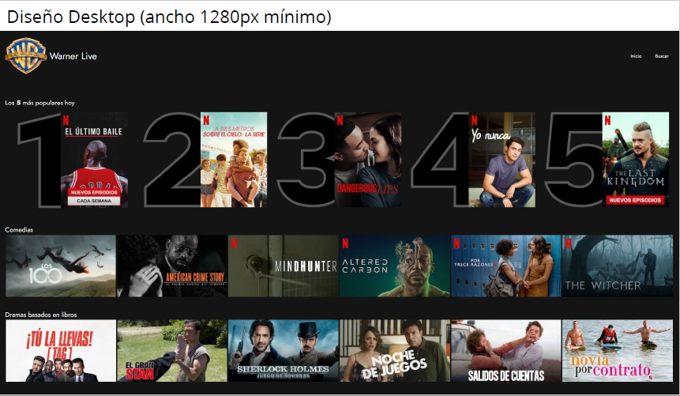
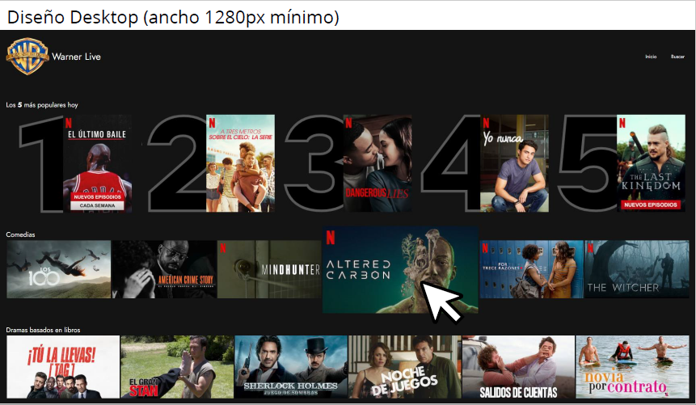
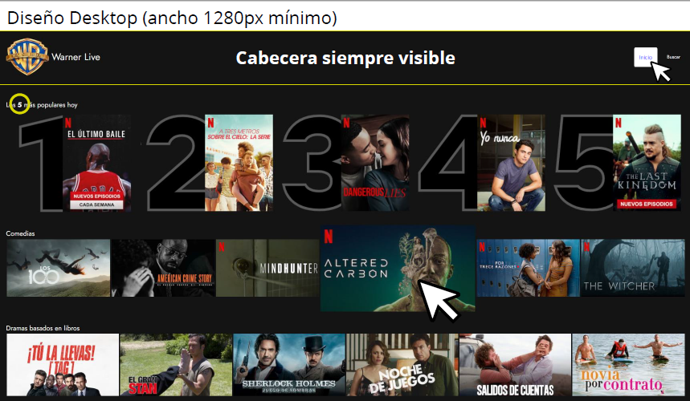
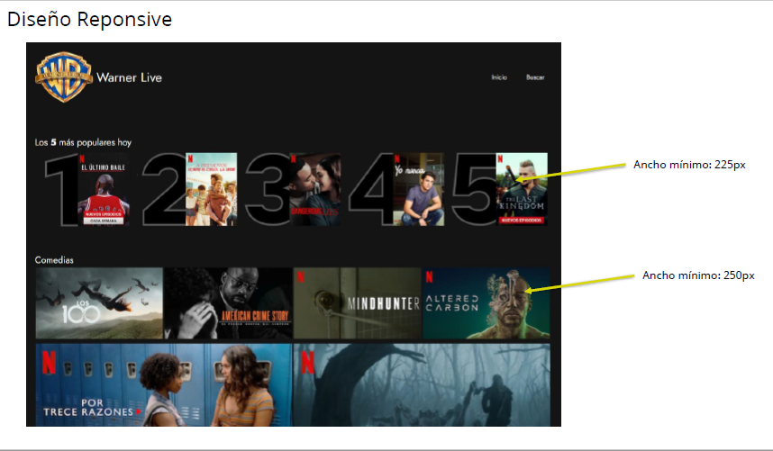
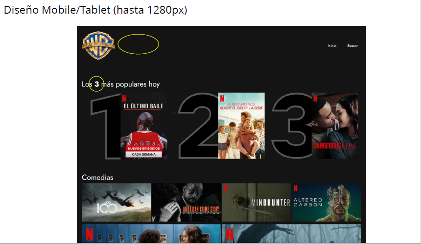
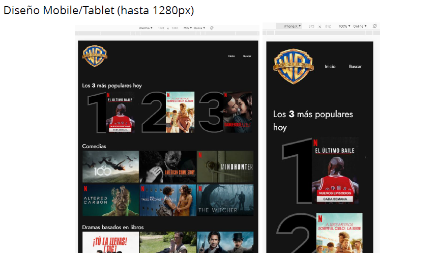

# 1_LAYOUT_ADVANCED

## Práctica del módulo de layout.

Una conocida casa cinematográfica quiere crear su propia plataforma on
line
para servir sus producciones, a la que van a llamar
WARNER LIVE .
Nos han solicitado una prueba de maquetación de un primer diseño,
del resultado de la prueba dependerá pasar a la siguiente fase de selección.

